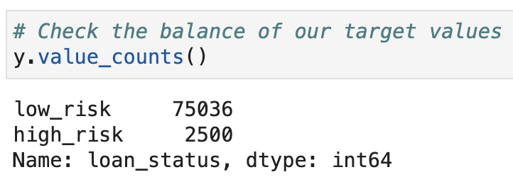
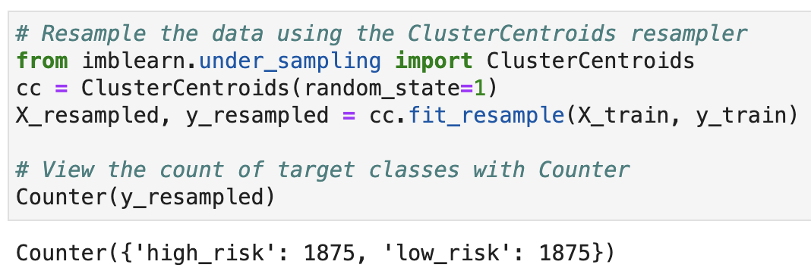

# Risky Business

The credit_risk_ensemble and credit_risk_resampling notebooks predict credit risk with machine learning techniques. Both notebooks build and evaluate several machine learning models to predict credit risk using data from peer-to-peer lending services. Credit risk is an inherently imbalanced classification problem, so different techniques are employed for training and evaluating models with imbalanced classes. After the data has been encoded and scaled, the imbalanced-learn and Scikit-learn libraries are used to build and evaluate models using Resampling and Ensemble Learning techniques.

---

## Technologies

Language: Python3, Pandas 

Imports: pandas, numpy, Path from pathlib, collections, train_test_split from sklearn.model_selection, StandardScaler from sklearn.preprocessing, LogisticRegression from sklearn.linear_model, RandomOverSampler and SMOTE from imblearn.over_sampling, ClusterCentroids from imblearn.under_sampling, SMOTEENN from imblearn.combine, BalancedRandomForestClassifier and EasyEnsembleClassifier from imblearn.ensemble, and  balanced_accuracy_score, confusion_matrix, and imbalanced_classification_report from sklearn.metrics

External Resources: lending_data.csv and LoanStats_2019Q1.csv

Developed with JupyterLab

---

## Installation

JupyterLab - [Install JupyterLab](https://jupyterlab.readthedocs.io/en/stable/getting_started/installation.html)

---

## Examples

We can see here the classes are very imbalanced:

Here is an example of the ClusterCentroid algorithm balancing the classes by Undersampling:

---

## Contributors

Drew Disbrow Marnell: dldmarnell@gmail.com

---

## License

MIT License
Copyright (c) 2021 Drew Disbrow Marnell